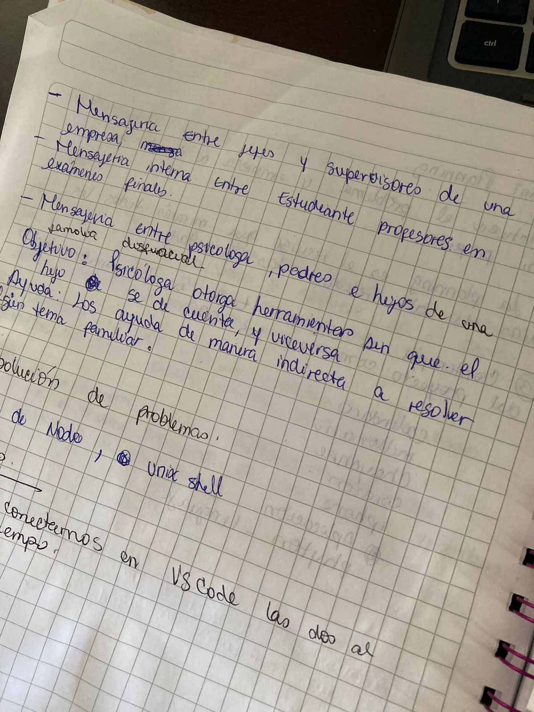

# Cifrado César

## Iniciación del proyecto
En la generación numero 18 de laboratoria, se nos presentó el reto de realizar una WebApp con una temática libre, pero basandonos en el cifrado cesar. Como dupla nos fue sencillo elegir un tema en común, decidimos abordar una problemática que esta presente en nuestro día a día, quisimos recrear un Página Web que tuviera como finalidad darle herramientas a padres o hijos que estuvieran atravesando por algún problema, o simplemente que quisieran enviar algún mensaje a un profesional, sin que este fuera descifrado.

## 1. Planificación

Partimos por encontrar un tema en el que ambas nos sintiéramos cómodas y fuera de nuestro interés, desarrollamos nuestros bosetos en hojas y lapiz. 
 
